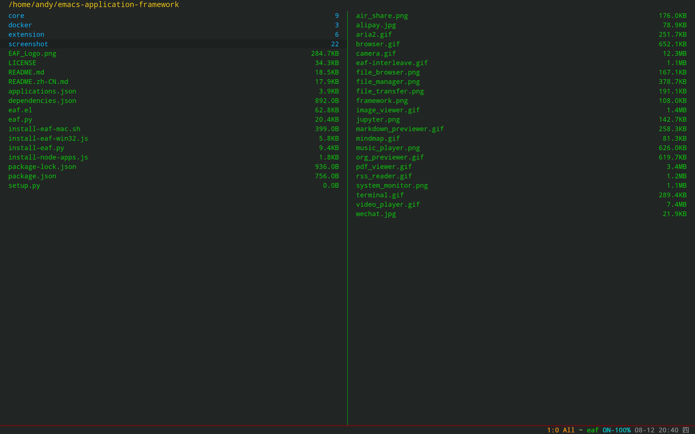
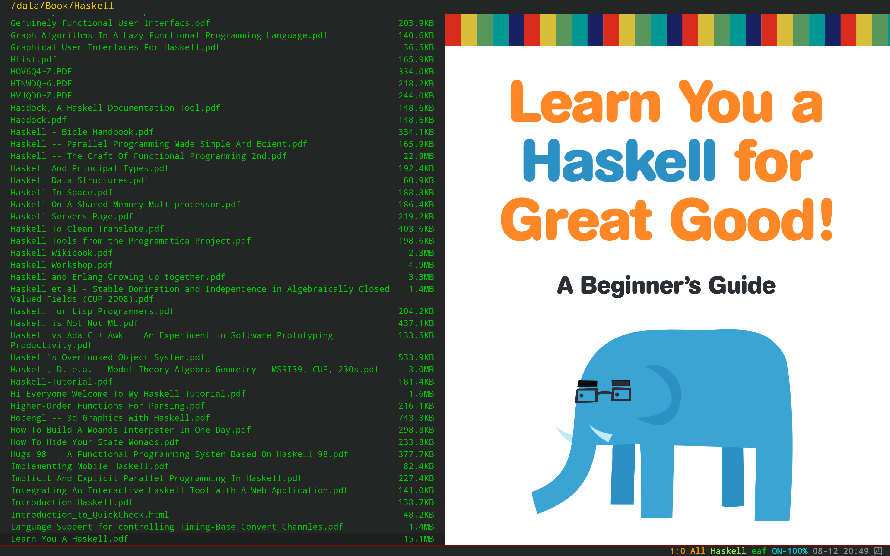
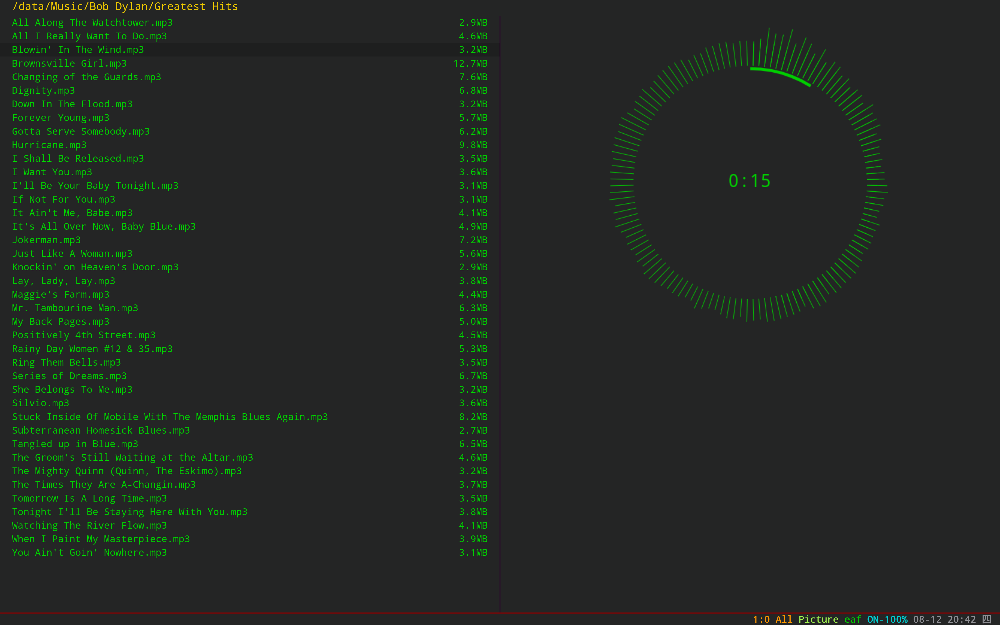

### EAF File Manager
<p align="center">
  
</p>

<p align="center">
  
</p>

<p align="center">
  
</p>

<p align="center">
  
</p>

File manager application for the [Emacs Application Framework](https://github.com/emacs-eaf/emacs-application-framework).

### Load application

```Elisp
(add-to-list 'load-path "~/.emacs.d/site-lisp/eaf-file-manager/")
(require 'eaf-file-manager)
```

### Dependency List

| Package        | Description          |
| :--------      | :------              |
| python-magic                   | Get the MIME type of the file                                      |

### The keybinding of EAF File Manager.

| Key   | Event   |
| :---- | :------ |
| `<f12>` | open_devtools |
| `h` | js_up_directory |
| `j` | js_select_next_file |
| `k` | js_select_prev_file |
| `l` | js_open_file |
| `<left>` | js_up_directory |
| `<down>` | js_select_next_file |
| `<up>` | js_select_prev_file |
| `<right>` | js_open_file |
| `f` | js_open_file |
| `SPC` | js_scroll_up_select_file |
| `b` | js_scroll_down_select_file |
| `<return>` | js_open_file |
| `'` | js_up_directory |
| `m` | js_mark_file |
| `u` | js_unmark_file |
| `U` | js_unmark_all_files |
| `d` | delete_selected_files |
| `D` | delete_current_file |
| `q` | bury-buffer |
